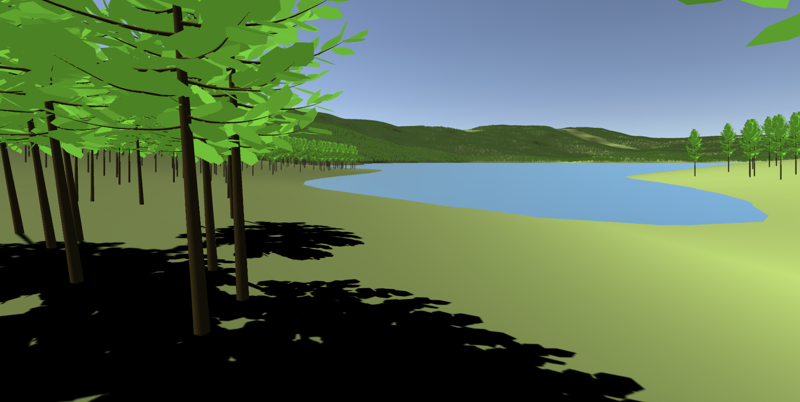

# Large scale forest in Build-In and Universal render pipelines

This repository contains large scale forest examples with millions of trees placed on terrain. The tree model is created using basic Blender Sappling tool setup. Terrain grass texture is a basic color texture, which can be regenerated CreateTexture.cs. The picture above shows how the forest in the scene looks like with 1 million trees running at more than 200 FPS. Mountains visible in the distance are part of large scale terrain with individual trees and not a background image. Player can move camera with WASD keys, rotate with right mouse button and zoom with mouse scroll to explore the world.

Repository includes two copies of the same project configured in both Built-In render pipeline and URP for comparison. Projects highlight that Unity tree billboard renderer can render millions of trees while using SpeedTree approach with LOD degrades performance by several orders of magnitude.

Currently URP does not support Unity tree billboard renderer as there is no Soft Occlussion shaders ported to URP. Bug report is submitted to [Issue Tracker](https://issuetracker.unity3d.com/issues/urp-pink-shaders-appear-near-camera-when-using-billboard-renderer) and awaiting for more votes. Discussions on Unity forums can be followed [here](https://forum.unity.com/threads/case-1227083-tree-nature-soft-occlusion-shader-in-urp.825825/). There is also a basic [YouTube tutorial](https://www.youtube.com/watch?v=zldsm0TvRJw) on how to setup trees in such way from Blender to Unity billboard renderer.
